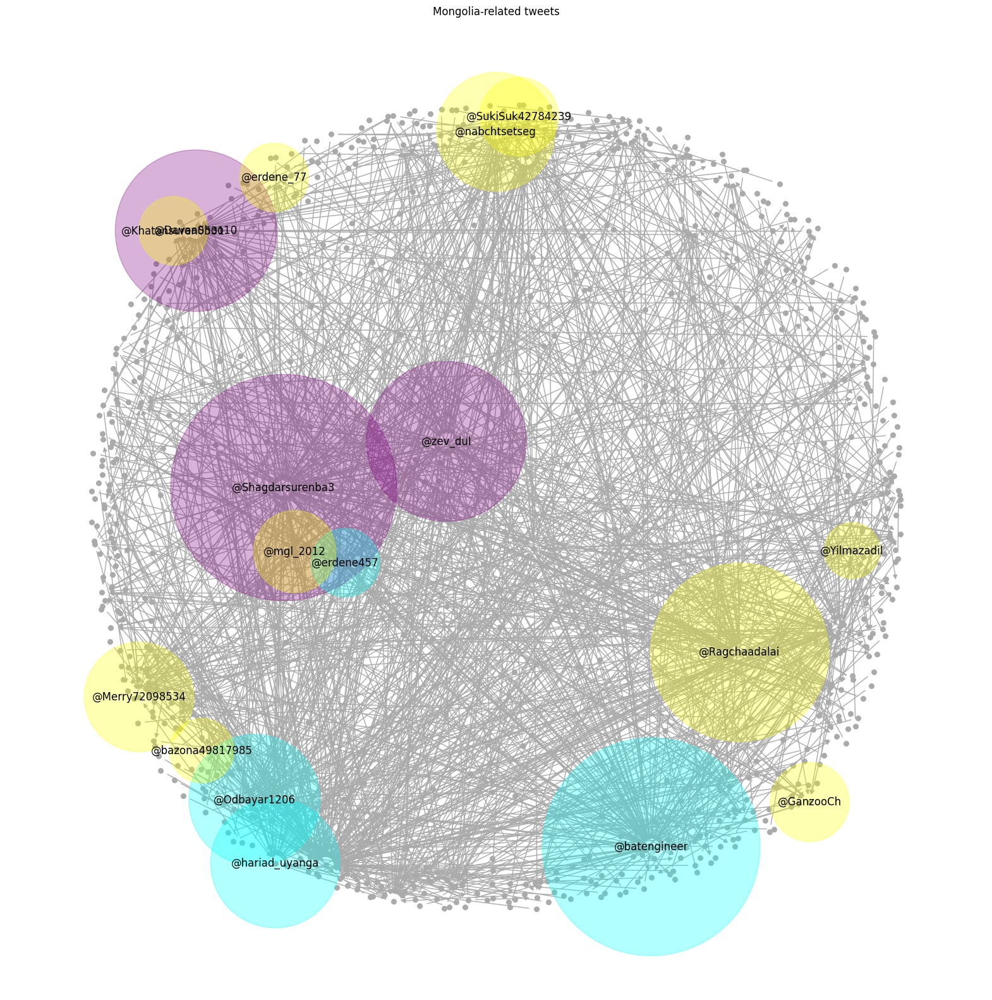

# Social Network Analysis on Mongolia-related Tweets

## About the project

I have been collecting certain tweets related to Mongolia as a topic since 2020.

Using this data, I tried to analyze and identify the most influencial users with the learnings from the class "МТССНДАМСС".

## Main results and methods used




## To replicate the results

### Requirements

```
pip install -r requirements.txt
```

After preparing the environment, please start the jupyter notebook **sna_mongolia_tweets.ipynb** and follow the code steps.

### Data

The tweet dataset I used is part of an ongoing data collection effort by me.

All data is included in this repo to be openly used.

### Code

Initial data analysis and data preparation code was written from scratch by me.

Pandas official documentation and Stackoverflow were used, of course.

Core of the Social network analysis code was taken from this [project by Julia Wu](https://github.com/hw355/sna_twitter).
